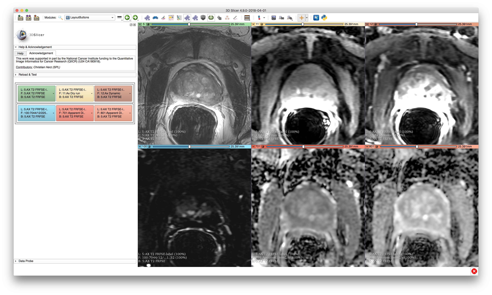

# SlicerLayoutButtons

This 3D Slicer extension can be used to easily access and modify the displayed images/labels for the current layout. Anytime the Slicer viewer layout changes, the module widget will adapt to it and provide information about the displated images that are displayed for background/foreground and additional to that the current label.

As you can see in the following screenshots, all buttons that are displayed in the module panel correspond to a specific slice view with its own color.

